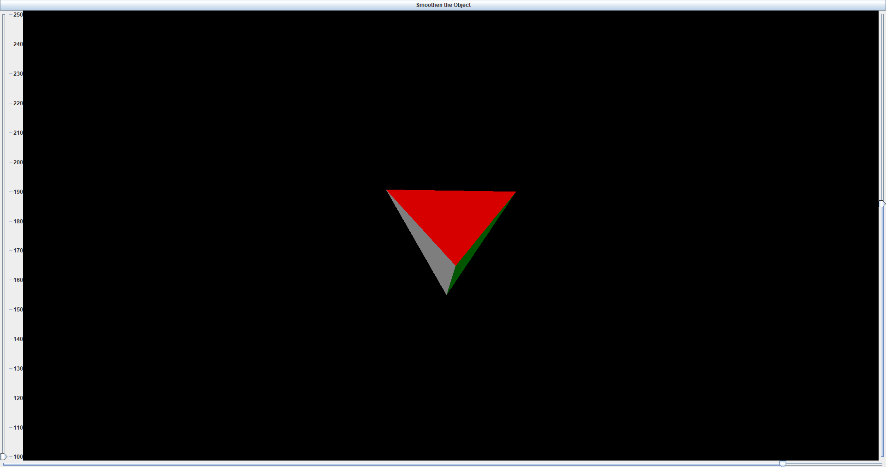
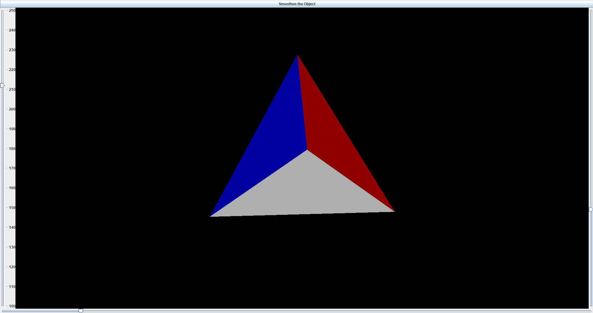
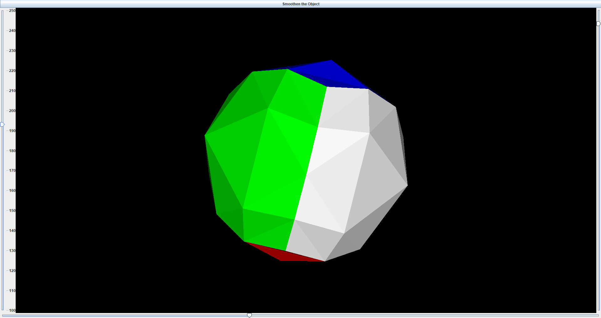
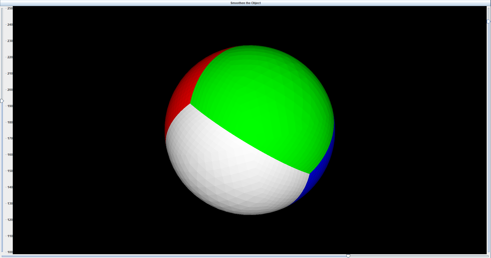

# 3D Object Viewer

## Overview
DemoViewer is a Java application that allows users to visualize and manipulate a 3D object. The application supports inflating and scaling objects, and provides a fluid scaling.

## Features
- Inflate 3D objects
- Scale 3D objects with high precision
- Real-time rendering and shading

## Requirements
- Java 8 or higher
- Maven

## Usage
1. Run the application
2. Use the "Smoothen Object" button to inflate the object.
3. Adjust the scale using the vertical slider on the left.
4. Use the horizontal slider on the bottom and the vertical slider on the right to rotate the object.

## Code Structure
- `src/main/java/org/example/DemoViewer.java`: Main class for the application.
- `src/main/java/org/example/Triangle.java`: Class representing a triangle in 3D space.
- `src/main/java/org/example/Vertex.java`: Class representing a vertex in 3D space.
- `src/main/java/org/example/Matrix3x3.java`: Utility class for 3x3 matrix operations.

## Screenshots

